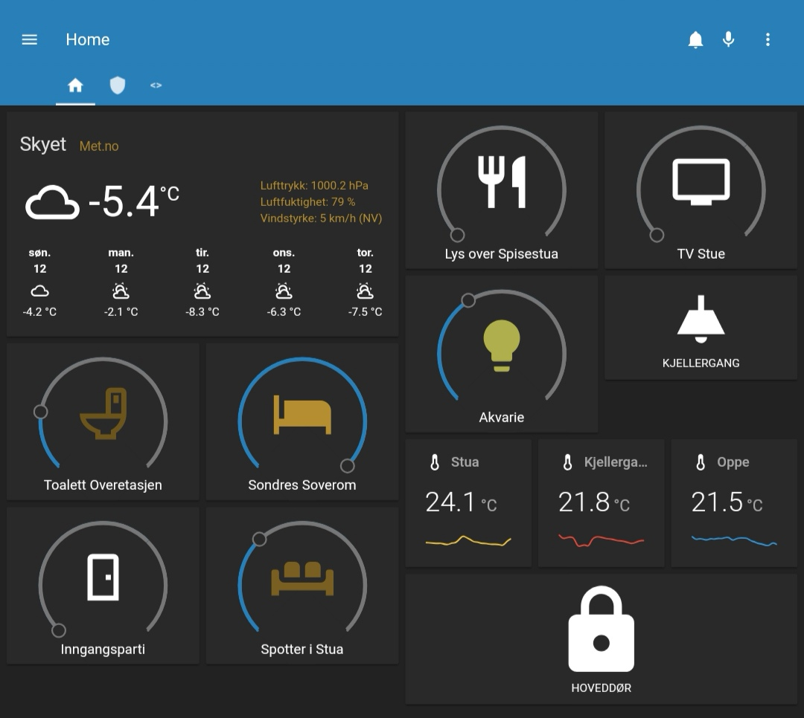

# home-hassio
Configuration files for my Home-Assistant Hass.IO Setup

Hello, this is my private setup for Home Assistant on a Raspberry Pi 3B, please steal all you want! That's what I have done :) 

Short info about my setup:

- Raspberry Pi 3
- deConz Raspbee hat for ZigBee and Proscon
- Aeotec Z Stick Gen5 for Z-Wave
- 32Gb microSD Card
- Zwave devices like dimmers and zwitches
- Zigbee devices mostly lights GU10 from Ikea and Philips HUE remotes and lights
- Verisure and Yale Doorman lock
- Sector Alarm home security system

In custom_compontents (/config/custom_components) I have installed the following:
  git clone https://github.com/mgejke/asyncsector
  git clone https://github.com/mgejke/hass-sectoralarm

Date, monday 7th of january 2019 I lost all my config and building it all from scratch. Initial setup from 2017 lost and therefor GitHub! 

If you have any questions reach out to me! 

  Email: stian@barmen.nu
  Web: https://www.sbarmen.no
  XMPP: stian@jabber.no
  Hangouts: stian@barmen.nu
